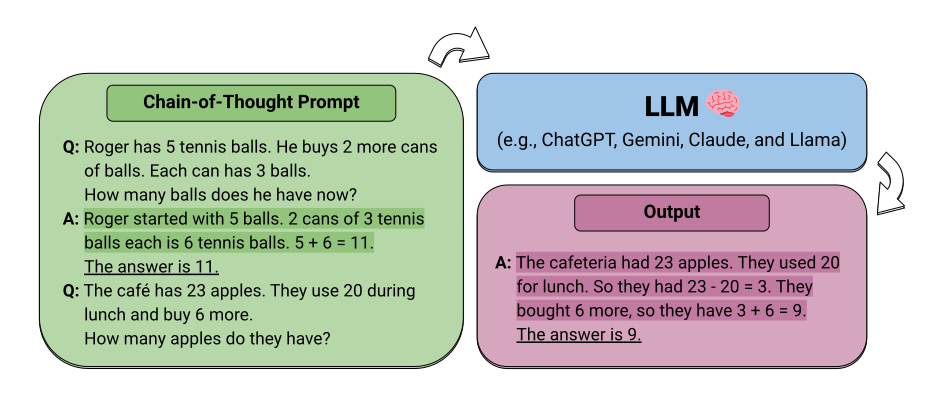

<h1 align="center">Reasoning in Large Language Models</h1>

    
    
    
    

    <b> Collection of papers and resources on how to unlock the reasoning ability of Large Language Models.</b>

    <i>Also check out the <a href="https://github.com/atfortes/Awesome-Multimodal-Reasoning">Awesome-Multimodal-Reasoning</a> collection!</i>

    

    Large Language Models have revolutionized the NLP landscape, showing improved performance and sample efficiency over smaller models. However, increasing model size alone has not proved sufficient for high performance on challenging reasoning tasks, such as solving arithmetic or commonsense problems. We present a collection of papers and resources on how to unlock these abilities.

## Contents

 - [Survey](#survey)
 - [Analysis](#analysis)
 - [Technique](#technique)
   - [Reasoning in Large Language Models - *An Emergent Ability*](#llm)
   - [Scaling Smaller Language Models to Reason](#lm)
 - [Benchmark](#benchmark)
 - [Other Useful Resources](#other-useful-resources)
 - [Other Awesome Lists](#other-awesome-lists)
 - [Contributing](#contributing)

## Survey

1. **Reasoning with Language Model Prompting: A Survey.** `ACL 2023`

    *Shuofei Qiao, Yixin Ou, Ningyu Zhang, Xiang Chen, Yunzhi Yao, Shumin Deng, Chuanqi Tan, Fei Huang, Huajun Chen.* [[Paper](https://arxiv.org/abs/2212.09597)] [[Code](https://github.com/zjunlp/Prompt4ReasoningPapers)], 2022.12

1. **Towards Reasoning in Large Language Models: A Survey.** `ACL 2023 (Findings)`

    *Jie Huang, Kevin Chen-Chuan Chang.* [[Paper](https://arxiv.org/abs/2212.10403)] [[Code](https://github.com/jeffhj/LM-reasoning)], 2022.12

## Analysis

1. **Can language models learn from explanations in context?.** `EMNLP 2022`

    *Andrew K. Lampinen, Ishita Dasgupta, Stephanie C. Y. Chan, Kory Matthewson, Michael Henry Tessler, Antonia Creswell, James L. McClelland, Jane X. Wang, Felix Hill.* [[Paper](https://arxiv.org/abs/2204.02329)], 2022.4

1. **Emergent Abilities of Large Language Models.** `TMLR 2022`
   
    *Jason Wei, Yi Tay, Rishi Bommasani, Colin Raffel, Barret Zoph, Sebastian Borgeaud, Dani Yogatama, Maarten Bosma, Denny Zhou, Donald Metzler, Ed H. Chi, Tatsunori Hashimoto, Oriol Vinyals, Percy Liang, Jeff Dean, William Fedus.* [[Paper](https://arxiv.org/abs/2206.07682)] [[Blog](https://ai.googleblog.com/2022/11/characterizing-emergent-phenomena-in.html)], 2022.6

1. **Challenging BIG-Bench Tasks and Whether Chain-of-Thought Can Solve Them.** `Preprint`

    *Mirac Suzgun, Nathan Scales, Nathanael Schärli, Sebastian Gehrmann, Yi Tay, Hyung Won Chung, Aakanksha Chowdhery, Quoc V. Le, Ed H. Chi, Denny Zhou, Jason Wei.* [[Paper](https://arxiv.org/abs/2210.09261)] [[Code](https://github.com/suzgunmirac/BIG-Bench-Hard)], 2022.10

1. **Towards Understanding Chain-of-Thought Prompting: An Empirical Study of What Matters.** `ACL 2023`
   
    *Boshi Wang, Sewon Min, Xiang Deng, Jiaming Shen, You Wu, Luke Zettlemoyer, Huan Sun.* [[Paper](https://arxiv.org/abs/2212.10001)] [[Code](https://github.com/sunlab-osu/Understanding-CoT)], 2022.12

1. **On Second Thought, Let's Not Think Step by Step! Bias and Toxicity in Zero-Shot Reasoning.** `ACL 2023`

    *Omar Shaikh, Hongxin Zhang, William Held, Michael Bernstein, Diyi Yang.* [[Paper](https://arxiv.org/abs/2212.08061)], 2022.12

1. **Dissociating language and thought in large language models: a cognitive perspective.** `Preprint`

    *Kyle Mahowald, Anna A. Ivanova, Idan A. Blank, Nancy Kanwisher, Joshua B. Tenenbaum, Evelina Fedorenko.* [[Paper](https://arxiv.org/abs/2301.06627)], 2023.1

1. **Large Language Models Can Be Easily Distracted by Irrelevant Context.** `ICML 2023`

    *Freda Shi, Xinyun Chen, Kanishka Misra, Nathan Scales, David Dohan, Ed Chi, Nathanael Schärli, Denny Zhou.* [[Paper](https://arxiv.org/abs/2302.00093)], 2023.1

1. **A Multitask, Multilingual, Multimodal Evaluation of ChatGPT on Reasoning, Hallucination, and Interactivity.** `Preprint`

    *Yejin Bang, Samuel Cahyawijaya, Nayeon Lee, Wenliang Dai, Dan Su, Bryan Wilie, Holy Lovenia, Ziwei Ji, Tiezheng Yu, Willy Chung, Quyet V. Do, Yan Xu, Pascale Fung.* [[Paper](https://arxiv.org/abs/2302.04023)], 2023.2

1. **Language Models Don't Always Say What They Think: Unfaithful Explanations in Chain-of-Thought Prompting.** `Preprint`

    *Miles Turpin, Julian Michael, Ethan Perez, Samuel R. Bowman.* [[Paper](https://arxiv.org/abs/2305.04388)] [[Code](https://github.com/milesaturpin/cot-unfaithfulness)], 2023.5

1. **Faith and Fate: Limits of Transformers on Compositionality.** `Preprint`

    *Nouha Dziri, Ximing Lu, Melanie Sclar, Xiang Lorraine Li, Liwei Jiang, Bill Yuchen Lin, Peter West, Chandra Bhagavatula, Ronan Le Bras, Jena D. Hwang, Soumya Sanyal, Sean Welleck, Xiang Ren, Allyson Ettinger, Zaid Harchaoui, Yejin Choi.* [[Paper](https://arxiv.org/abs/2305.18654)], 2023.5

1. **Measuring Faithfulness in Chain-of-Thought Reasoning.** `Preprint`

    *Tamera Lanham, Anna Chen, Ansh Radhakrishnan, Benoit Steiner, Carson Denison, Danny Hernandez, Dustin Li, Esin Durmus, Evan Hubinger, Jackson Kernion, Kamilė Lukošiūtė, Karina Nguyen, Newton Cheng, Nicholas Joseph, Nicholas Schiefer, Oliver Rausch, Robin Larson, Sam McCandlish, Sandipan Kundu, Saurav Kadavath, Shannon Yang, Thomas Henighan, Timothy Maxwell, Timothy Telleen-Lawton, Tristan Hume, Zac Hatfield-Dodds, Jared Kaplan, Jan Brauner, Samuel R. Bowman, Ethan Perez.* [[Paper](https://arxiv.org/abs/2307.13702)], 2023.7

1. **Large Language Models Cannot Self-Correct Reasoning Yet.** `Preprint`

    *Jie Huang, Xinyun Chen, Swaroop Mishra, Huaixiu Steven Zheng, Adams Wei Yu, Xinying Song, Denny Zhou.* [[Paper](https://arxiv.org/abs/2310.01798)], 2023.10

## Technique

<h3 id="llm">Reasoning in Large Language Models - <i>An Emergent Ability</i></h3>

1. **Chain of Thought Prompting Elicits Reasoning in Large Language Models.** `NeurIPS 2022`

    *Jason Wei, Xuezhi Wang, Dale Schuurmans, Maarten Bosma, Brian Ichter, Fei Xia, Ed Chi, Quoc Le, Denny Zhou.* [[Paper](https://arxiv.org/abs/2201.11903)] [[Blog](https://ai.googleblog.com/2022/05/language-models-perform-reasoning-via.html)], 2022.1

1. **Self-consistency improves chain of thought reasoning in language models.** `ICLR 2023`

    *Xuezhi Wang, Jason Wei, Dale Schuurmans, Quoc Le, Ed Chi, Sharan Narang, Aakanksha Chowdhery, Denny Zhou.* [[Paper](https://arxiv.org/abs/2203.11171)], 2022.3

1. **Iteratively Prompt Pre-trained Language Models for Chain of Thought.** `EMNLP 2022`

    *Boshi Wang, Xiang Deng, Huan Sun.* [[Paper](https://arxiv.org/abs/2203.08383)] [[Code](https://github.com/sunlab-osu/iterprompt)]

1. **Least-to-most prompting enables complex reasoning in large language models.** `ICLR 2023`

    *Denny Zhou, Nathanael Schärli, Le Hou, Jason Wei, Nathan Scales, Xuezhi Wang, Dale Schuurmans, Claire Cui, Olivier Bousquet, Quoc Le, Ed Chi.* [[Paper](https://arxiv.org/abs/2205.10625)], 2022.5

1. **Large Language Models are Zero-Shot Reasoners.** `NeurIPS 2022`
   
    *Takeshi Kojima, Shixiang Shane Gu, Machel Reid, Yutaka Matsuo, Yusuke Iwasawa.* [[Paper](https://arxiv.org/abs/2205.11916)], 2022.5

1. **Making Large Language Models Better Reasoners with Step-Aware Verifier.** `Preprint`
   
    *Yifei Li, Zeqi Lin, Shizhuo Zhang, Qiang Fu, Bei Chen, Jian-Guang Lou, Weizhu Chen.* [[Paper](https://arxiv.org/abs/2206.02336)], 2022.6

1. **Large Language Models Still Can't Plan.** `NeurIPS 2022`
   
    *Karthik Valmeekam, Alberto Olmo, Sarath Sreedharan, Subbarao Kambhampati.* [[Paper](https://arxiv.org/abs/2206.10498)] [[Code](https://github.com/karthikv792/gpt-plan-benchmark)], 2022.6

1. **Solving Quantitative Reasoning Problems with Language Models.** `NeurIPS 2022`

    *Aitor Lewkowycz, Anders Andreassen, David Dohan, Ethan Dyer, Henryk Michalewski, Vinay Ramasesh, Ambrose Slone, Cem Anil, Imanol Schlag, Theo Gutman-Solo, Yuhuai Wu, Behnam Neyshabur, Guy Gur-Ari, Vedant Misra.* [[Paper](https://arxiv.org/abs/2206.14858)] [[Blog](https://ai.googleblog.com/2022/06/minerva-solving-quantitative-reasoning.html)], 2022.6

1. **Rationale-Augmented Ensembles in Language Models.** `Preprint`

    *Xuezhi Wang, Jason Wei, Dale Schuurmans, Quoc Le, Ed Chi, Denny Zhou.* [[Paper](https://arxiv.org/abs/2207.00747)], 2022.7

1. **Dynamic Prompt Learning via Policy Gradient for Semi-structured Mathematical Reasoning.** `ICLR 2023`

    *Pan Lu, Liang Qiu, Kai-Wei Chang, Ying Nian Wu, Song-Chun Zhu, Tanmay Rajpurohit, Peter Clark, Ashwin Kalyan.* [[Project](https://promptpg.github.io/)] [[Paper](https://arxiv.org/abs/2209.14610)] [[Code](https://github.com/lupantech/PromptPG)], 2022.9

1. **Ask Me Anything: A simple strategy for prompting language models.** `ICLR 2023`

    *Simran Arora, Avanika Narayan, Mayee F. Chen, Laurel Orr, Neel Guha, Kush Bhatia, Ines Chami, Frederic Sala, Christopher Ré.* [[Paper](https://arxiv.org/abs/2210.02441)] [[Code](https://github.com/hazyresearch/ama_prompting)], 2022.10

1. **Language Models are Multilingual Chain-of-Thought Reasoners.** `ICLR 2023`
   
    *Freda Shi, Mirac Suzgun, Markus Freitag, Xuezhi Wang, Suraj Srivats, Soroush Vosoughi, Hyung Won Chung, Yi Tay, Sebastian Ruder, Denny Zhou, Dipanjan Das, Jason Wei.* [[Paper](https://arxiv.org/abs/2210.03057)], 2022.10

1. **Measuring and Narrowing the Compositionality Gap in Language Models.** `Preprint`

    *Ofir Press, Muru Zhang, Sewon Min, Ludwig Schmidt, Noah A. Smith, Mike Lewis.* [[Paper](https://arxiv.org/abs/2210.03350)], 2022.10

1. **Automatic Chain of Thought Prompting in Large Language Models.** `ICLR 2023`
   
    *Zhuosheng Zhang, Aston Zhang, Mu Li, Alex Smola.* [[Paper](https://arxiv.org/abs/2210.03493)] [[Code](https://github.com/amazon-research/auto-cot)], 2022.10

1. **ReAct: Synergizing Reasoning and Acting in Language Models.** `NeurIPS 2022 (Workshop: FMDM)`
   
    *Shunyu Yao, Jeffrey Zhao, Dian Yu, Nan Du, Izhak Shafran, Karthik Narasimhan, Yuan Cao.* [[Project](https://react-lm.github.io/)] [[Paper](https://arxiv.org/abs/2210.03629)] [[Code](https://github.com/ysymyth/ReAct)] [[Blog](https://ai.googleblog.com/2022/11/react-synergizing-reasoning-and-acting.html)], 2022.10

1. **Reflection of Thought: Inversely Eliciting Numerical Reasoning in Language Models via Solving Linear Systems.** `Preprint`

    *Fan Zhou, Haoyu Dong, Qian Liu, Zhoujun Cheng, Shi Han, Dongmei Zhang.* [[Paper](https://arxiv.org/abs/2210.05075)], 2022.10

1. **Mind's Eye: Grounded language model reasoning through simulation.** `ICLR 2023`
   
    *Ruibo Liu, Jason Wei, Shixiang Shane Gu, Te-Yen Wu, Soroush Vosoughi, Claire Cui, Denny Zhou, Andrew M. Dai.* [[Paper](https://arxiv.org/abs/2210.05359)], 2022.10

1. **Language Models of Code are Few-Shot Commonsense Learners.** `EMNLP 2022`
   
    *Aman Madaan, Shuyan Zhou, Uri Alon, Yiming Yang, Graham Neubig.* [[Paper](https://arxiv.org/abs/2210.07128)] [[Code](https://github.com/madaan/cocogen)], 2022.10

1. **Large Language Models Can Self-Improve.** `Preprint`
   
    *Jiaxin Huang, Shixiang Shane Gu, Le Hou, Yuexin Wu, Xuezhi Wang, Hongkun Yu, Jiawei Han.* [[Paper](https://arxiv.org/abs/2210.11610)], 2022.10

1. **Retrieval Augmentation for Commonsense Reasoning: A Unified Approach.** `EMNLP 2022`
   
    *Wenhao Yu, Chenguang Zhu, Zhihan Zhang, Shuohang Wang, Zhuosheng Zhang, Yuwei Fang, Meng Jiang.* [[Paper](https://arxiv.org/abs/2210.12887)] [[Code](https://github.com/wyu97/RACo)], 2022.10

1. **PAL: Program-aided Language Models.** `ICML 2023`
   
    *Luyu Gao, Aman Madaan, Shuyan Zhou, Uri Alon, Pengfei Liu, Yiming Yang, Jamie Callan, Graham Neubig.* [[Project](https://reasonwithpal.com/)] [[Paper](https://arxiv.org/abs/2211.10435)] [[Code](https://github.com/reasoning-machines/pal)], 2022.11

1. **Unsupervised Explanation Generation via Correct Instantiations.** `AAAI 2023`

    *Sijie Cheng, Zhiyong Wu, Jiangjie Chen, Zhixing Li, Yang Liu, Lingpeng Kong.* [[Paper](https://arxiv.org/abs/2211.11160)], 2022.11

1. **Program of Thoughts Prompting: Disentangling Computation from Reasoning for Numerical Reasoning Tasks.** `Preprint`

    *Wenhu Chen, Xueguang Ma, Xinyi Wang, William W. Cohen.* [[Paper](https://arxiv.org/abs/2211.12588)] [[Code](https://github.com/wenhuchen/program-of-thoughts)], 2022.11

1. **Complementary Explanations for Effective In-Context Learning.** `ACL 2023 (Findings)`

    *Xi Ye, Srinivasan Iyer, Asli Celikyilmaz, Ves Stoyanov, Greg Durrett, Ramakanth Pasunuru.* [[Paper](https://arxiv.org/abs/2211.13892)], 2022.11

1. **MURMUR: Modular Multi-Step Reasoning for Semi-Structured Data-to-Text Generation.** `Preprint`

    *Swarnadeep Saha, Xinyan Velocity Yu, Mohit Bansal, Ramakanth Pasunuru, Asli Celikyilmaz.* [[Paper](https://arxiv.org/abs/2212.08607)], 2022.12

1. **Can Retriever-Augmented Language Models Reason? The Blame Game Between the Retriever and the Language Model.** `Preprint`

    *Parishad BehnamGhader, Santiago Miret, Siva Reddy.* [[Paper](https://arxiv.org/abs/2212.09146)] [[Code](https://github.com/McGill-NLP/retriever-lm-reasoning)], 2022.12

1. **Large Language Models are reasoners with Self-Verification.** `Preprint`

    *Yixuan Weng, Minjun Zhu, Shizhu He, Kang Liu, Jun Zhao.* [[Paper](https://arxiv.org/abs/2212.09561)] [[Code](https://github.com/WENGSYX/Self-Verification)], 2022.12

1. **Interleaving Retrieval with Chain-of-Thought Reasoning for Knowledge-Intensive Multi-Step Questions.** `Preprint`

    *Harsh Trivedi, Niranjan Balasubramanian, Tushar Khot, Ashish Sabharwal.* [[Paper](https://arxiv.org/abs/2212.10509)] [[Code](https://github.com/StonyBrookNLP/ircot)], 2022.12

1. **Language Models as Inductive Reasoners.** `Preprint`

    *Zonglin Yang, Li Dong, Xinya Du, Hao Cheng, Erik Cambria, Xiaodong Liu, Jianfeng Gao, Furu Wei.* [[Paper](https://arxiv.org/abs/2212.10923)], 2022.12

1. **LAMBADA: Backward Chaining for Automated Reasoning in Natural Language.** `Preprint`

    *Seyed Mehran Kazemi, Najoung Kim, Deepti Bhatia, Xin Xu, Deepak Ramachandran.* [[Paper](https://arxiv.org/abs/2212.13894)], 2022.12

1. **Rethinking with Retrieval: Faithful Large Language Model Inference.** `Preprint`

    *Hangfeng He, Hongming Zhang, Dan Roth.* [[Paper](https://arxiv.org/abs/2301.00303)], 2023.1

1. **Specializing Smaller Language Models towards Multi-Step Reasoning.** `Preprint`

    *Yao Fu, Hao Peng, Litu Ou, Ashish Sabharwal, Tushar Khot.* [[Paper](https://arxiv.org/abs/2301.12726)], 2023.1

1. **Faithful Chain-of-Thought Reasoning.** `Preprint`

    *Qing Lyu, Shreya Havaldar, Adam Stein, Li Zhang, Delip Rao, Eric Wong, Marianna Apidianaki, Chris Callison-Burch.* [[Paper](https://arxiv.org/abs/2301.13379)], 2023.1
    
1. **Large Language Models are Versatile Decomposers: Decompose Evidence and Questions for Table-based Reasoning.** `Preprint`

    *Yunhu Ye, Binyuan Hui, Min Yang, Binhua Li, Fei Huang, Yongbin Li.* [[Paper](https://arxiv.org/abs/2301.13808)], 2023.1

1. **Synthetic Prompting: Generating Chain-of-Thought Demonstrations for Large Language Models.** `Preprint`

    *Zhihong Shao, Yeyun Gong, Yelong Shen, Minlie Huang, Nan Duan, Weizhu Chen.* [[Paper](https://arxiv.org/abs/2302.00618)], 2023.2

1. **Multimodal Chain-of-Thought Reasoning in Language Models.** `Preprint`

    *Zhuosheng Zhang, Aston Zhang, Mu Li, Hai Zhao, George Karypis, Alex Smola.* [[Paper](https://arxiv.org/abs/2302.00923)] [[Code](https://github.com/amazon-science/mm-cot)], 2023.2

1. **Active Prompting with Chain-of-Thought for Large Language Models.** `Preprint`

    *Shizhe Diao, Pengcheng Wang, Yong Lin, Tong Zhang.* [[Paper](https://arxiv.org/abs/2302.12246)] [[Code](https://github.com/shizhediao/active-cot)], 2023.2

1. **Automatic Prompt Augmentation and Selection with Chain-of-Thought from Labeled Data.** `Preprint`

    *KaShun Shum, Shizhe Diao, Tong Zhang.* [[Paper](https://arxiv.org/abs/2302.12822)] [[Code](https://github.com/shizhediao/automate-cot)], 2023.2

1. **Language Is Not All You Need: Aligning Perception with Language Models.** `Preprint`

    *Shaohan Huang, Li Dong, Wenhui Wang, Yaru Hao, Saksham Singhal, Shuming Ma, Tengchao Lv, Lei Cui, Owais Khan Mohammed, Barun Patra, Qiang Liu, Kriti Aggarwal, Zewen Chi, Johan Bjorck, Vishrav Chaudhary, Subhojit Som, Xia Song, Furu Wei.* [[Paper](https://arxiv.org/abs/2302.14045)] [[Code](https://github.com/microsoft/unilm)], 2023.2

1. **ART: Automatic multi-step reasoning and tool-use for large language models.** `Preprint`

    *Bhargavi Paranjape, Scott Lundberg, Sameer Singh, Hannaneh Hajishirzi, Luke Zettlemoyer, Marco Tulio Ribeiro.* [[Paper](https://arxiv.org/abs/2303.09014)], 2023.3
    
1. **REFINER: Reasoning Feedback on Intermediate Representations.** `Preprint`

    *Debjit Paul, Mete Ismayilzada, Maxime Peyrard, Beatriz Borges, Antoine Bosselut, Robert West, Boi Faltings.* [[Project](https://debjitpaul.github.io/refiner/)] [[Paper](https://arxiv.org/abs/2304.01904)] [[Code](https://github.com/debjitpaul/refiner)], 2023.4

1. **Tree of Thoughts: Deliberate Problem Solving with Large Language Models.** `Preprint`

    *Shunyu Yao, Dian Yu, Jeffrey Zhao, Izhak Shafran, Thomas L. Griffiths, Yuan Cao, Karthik Narasimhan.* [[Paper](https://arxiv.org/abs/2305.10601)] [[Code](https://github.com/ysymyth/tree-of-thought-llm)], 2023.5

1. **Reasoning Implicit Sentiment with Chain-of-Thought Prompting** `ACL 2023`

    *Hao Fei, Bobo Li, Qian Liu, Lidong Bing, Fei Li, Tat-Seng Chua.* [[Paper](https://arxiv.org/abs/2305.11255)] [[Code](https://github.com/scofield7419/THOR-ISA)], 2023.05

1. **LLMs as Factual Reasoners: Insights from Existing Benchmarks and Beyond.** `Preprint`
    
    *Philippe Laban, Wojciech Kryściński, Divyansh Agarwal, Alexander R. Fabbri, Caiming Xiong, Shafiq Joty, Chien-Sheng Wu.* [[Paper](https://arxiv.org/abs/2305.14540)], 2023.5
    
1. **Reasoning with Language Model is Planning with World Model.** `Preprint`
    
    *Shibo Hao, Yi Gu, Haodi Ma, Joshua Jiahua Hong, Zhen Wang, Daisy Zhe Wang, Zhiting Hu.* [[Paper](https://arxiv.org/abs/2305.14992)], 2023.5

1. **Recursion of Thought: A Divide and Conquer Approach to Multi-Context Reasoning with Language Models.** `ACL 2023 (Findings)`

    *Soochan Lee, Gunhee Kim.* [[Paper](https://arxiv.org/abs/2306.06891)] [[Code](https://github.com/soochan-lee/RoT)] [[Poster](https://soochanlee.com/img/rot/rot_poster.pdf)], 2023.6

1. **Question Decomposition Improves the Faithfulness of Model-Generated Reasoning.** `Preprint`

    *Ansh Radhakrishnan, Karina Nguyen, Anna Chen, Carol Chen, Carson Denison, Danny Hernandez, Esin Durmus, Evan Hubinger, Jackson Kernion, Kamilė Lukošiūtė, Newton Cheng, Nicholas Joseph, Nicholas Schiefer, Oliver Rausch, Sam McCandlish, Sheer El Showk, Tamera Lanham, Tim Maxwell, Venkatesa Chandrasekaran, Zac Hatfield-Dodds, Jared Kaplan, Jan Brauner, Samuel R. Bowman, Ethan Perez.* [[Paper](https://arxiv.org/abs/2307.11768)] [[Code](https://github.com/anthropics/DecompositionFaithfulnessPaper)], 2023.7

1. **Skeleton-of-Thought: Large Language Models Can Do Parallel Decoding.** `Preprint`

    *Xuefei Ning, Zinan Lin, Zixuan Zhou, Huazhong Yang, Yu Wang.* [[Paper](https://arxiv.org/abs/2307.15337)], 2023.7

1. **Skills-in-Context Prompting: Unlocking Compositionality in Large Language Models.** `Preprint`

    *Jiaao Chen, Xiaoman Pan, Dian Yu, Kaiqiang Song, Xiaoyang Wang, Dong Yu, Jianshu Chen.* [[Paper](https://arxiv.org/abs/2308.00304)], 2023.8 

1. **Skills-in-Context Prompting: Unlocking Compositionality in Large Language Models.** `Preprint`

    *Jiaao Chen, Xiaoman Pan, Dian Yu, Kaiqiang Song, Xiaoyang Wang, Dong Yu, Jianshu Chen.* [[Paper](https://arxiv.org/abs/2308.00304)], 2023.8

1. **Chain-of-Verification Reduces Hallucination in Large Language Models.** `Preprint`

    *Shehzaad Dhuliawala, Mojtaba Komeili, Jing Xu, Roberta Raileanu, Xian Li, Asli Celikyilmaz, Jason Weston.* [[Paper](https://arxiv.org/abs/2309.11495)], 2023.9

1. **Enable Language Models to Implicitly Learn Self-Improvement From Data.** `Preprint`

    *Ziqi Wang, Le Hou, Tianjian Lu, Yuexin Wu, Yunxuan Li, Hongkun Yu, Heng Ji.* [[Paper](https://arxiv.org/abs/2310.00898)], 2023.10

1. **Improving Large Language Model Fine-tuning for Solving Math Problems.** `Preprint`

    *Yixin Liu, Avi Singh, C. Daniel Freeman, John D. Co-Reyes, Peter J. Liu.* [[Paper](https://arxiv.org/abs/2310.10047)], 2023.10

1. **Teaching Language Models to Self-Improve through Interactive Demonstrations.** `Preprint`

    *Xiao Yu, Baolin Peng, Michel Galley, Jianfeng Gao, Zhou Yu.* [[Paper](https://arxiv.org/abs/2310.13522)], 2023.10

1. **Learning From Mistakes Makes LLM Better Reasoner.** `Preprint`

    *Shengnan An, Zexiong Ma, Zeqi Lin, Nanning Zheng, Jian-Guang Lou, Weizhu Chen.* [[Paper](https://arxiv.org/abs/2310.20689)], 2023.10

1. **Fast Chain-of-Thought: A Glance of Future from Parallel Decoding Leads to Answers Faster.** `Preprint`

    *Hongxuan Zhang, Zhining Liu, Jiaqi Zheng, Chenyi Zhuang, Jinjie Gu, Guihai Chen.* [[Paper](https://arxiv.org/abs/2311.08263)], 2023.11

1. **Contrastive Chain-of-Thought Prompting.** `Preprint`

    *Yew Ken Chia, Guizhen Chen, Luu Anh Tuan, Soujanya Poria, Lidong Bing.* [[Paper](https://arxiv.org/abs/2311.09277)] [[Code](https://github.com/DAMO-NLP-SG/contrastive-cot)], 2023.11

### <h3 id="lm">Scaling Smaller Language Models to Reason<h3/>

1. **Scaling Instruction-Finetuned Language Models.** `Preprint`

    *Hyung Won Chung, Le Hou, Shayne Longpre, Barret Zoph, Yi Tay, William Fedus, Eric Li, Xuezhi Wang, Mostafa Dehghani, Siddhartha Brahma, Albert Webson, Shixiang Shane Gu, Zhuyun Dai, Mirac Suzgun, Xinyun Chen, Aakanksha Chowdhery, Sharan Narang, Gaurav Mishra, Adams Yu, Vincent Zhao, Yanping Huang, Andrew Dai, Hongkun Yu, Slav Petrov, Ed H. Chi, Jeff Dean, Jacob Devlin, Adam Roberts, Denny Zhou, Quoc V. Le, Jason Wei.* [[Paper](https://arxiv.org/abs/2210.11416)], 2022.10

1. **Distilling Multi-Step Reasoning Capabilities of Large Language Models into Smaller Models via Semantic Decompositions.** `ACL 2023 (Findings)`

    *Kumar Shridhar, Alessandro Stolfo, Mrinmaya Sachan.* [[Paper](https://arxiv.org/abs/2212.00193)], 2022.12

1. **Teaching Small Language Models to Reason.** `Preprint`

    *Lucie Charlotte Magister, Jonathan Mallinson, Jakub Adamek, Eric Malmi, Aliaksei Severyn.* [[Paper](https://arxiv.org/abs/2212.08410)], 2022.12

1. **Large Language Models Are Reasoning Teachers.** `ACL 2023`

    *Namgyu Ho, Laura Schmid, Se-Young Yun.* [[Paper](https://arxiv.org/abs/2212.10071)] [[Code](https://github.com/itsnamgyu/reasoning-teacher)], 2022.12
    
1. **Specializing Smaller Language Models towards Multi-Step Reasoning.** `Preprint`

    *Yao Fu, Hao Peng, Litu Ou, Ashish Sabharwal, Tushar Khot.* [[Paper](https://arxiv.org/abs/2301.12726)], 2023.1

1. **Symbolic Chain-of-Thought Distillation: Small Models Can Also "Think" Step-by-Step.** `ACL 2023`

    *Liunian Harold Li, Jack Hessel, Youngjae Yu, Xiang Ren, Kai-Wei Chang, Yejin Choi.* [[Paper](https://arxiv.org/abs/2306.14050)] [[Code](https://github.com/allenai/cot_distillation)], 2023.6

1. **Learning Deductive Reasoning from Synthetic Corpus based on Formal Logic.** `ICML 2023`

    *Terufumi Morishita, Gaku Morio, Atsuki Yamaguchi, Yasuhiro Sogawa.* [[Paper](https://arxiv.org/abs/2308.07336)] [[Code](https://github.com/hitachi-nlp/FLD)], 2023.7

## Benchmark

| Reasoning Ability | Benchmarks |
| :----------------------------------------------: | :---------------------------------------------- |
|  Arithmetic  | [GSM8K](https://arxiv.org/abs/2110.14168) / [SVAMP](https://aclanthology.org/2021.naacl-main.168) / [ASDiv](https://aclanthology.org/2020.acl-main.92/) / [AQuA](https://aclanthology.org/P17-1015/) / [MAWPS](https://aclanthology.org/N16-1136/) / [AddSub](https://aclanthology.org/D14-1058/) / [MultiArith](https://aclanthology.org/D15-1202/) / [SingleEq](https://aclanthology.org/Q15-1042/) / [SingleOp]( https://doi.org/10.1162/tacl_a_00118) / [Lila](https://arxiv.org/abs/2210.17517) |
|  Commonsense  | [CommonsenseQA](https://arxiv.org/abs/1811.00937) / [StrategyQA](https://arxiv.org/abs/2101.02235) / [ARC](https://arxiv.org/abs/1803.05457) / [BoolQ](https://arxiv.org/abs/1905.10044) / [HotpotQA](https://arxiv.org/abs/1809.09600) / [OpenBookQA](https://arxiv.org/abs/1809.02789) / [PIQA](https://arxiv.org/abs/1911.11641) |
|  Symbolic  | [CoinFlip](https://arxiv.org/abs/2201.11903) / [LastLetterConcatenation](https://arxiv.org/abs/2201.11903) / [ReverseList](https://arxiv.org/abs/2201.11903v1) |
|  Logical  | [ReClor](https://arxiv.org/abs/2002.04326) / [LogiQA](https://arxiv.org/abs/2007.08124) / [ProofWriter](https://arxiv.org/abs/2012.13048) / [FLD](https://arxiv.org/abs/2308.07336)
|  Other  | [ARB](https://arxiv.org/abs/2307.13692) / [BIG-bench](https://doi.org/10.48550/arXiv.2206.04615) / [AGIEval](https://arxiv.org/abs/2304.06364) / [ALERT](https://arxiv.org/abs/2212.08286) / [CONDAQA](https://arxiv.org/abs/2211.00295) / [SCAN](https://arxiv.org/abs/1711.00350) / [WikiWhy](https://arxiv.org/abs/2210.12152) |

**Note:** Although there is no official version for the **Symbolic Reasoning** benchmarks, you can generate your own **[here](https://github.com/atfortes/DataGenLM)**!

## Other Useful Resources

- **[LLM Reasoners](https://github.com/Ber666/llm-reasoners)**  A library for advanced large language model reasoning
- **[Chain-of-Thought Hub](https://github.com/FranxYao/chain-of-thought-hub)**  Benchmarking LLM reasoning performance with chain-of-thought prompting.
- **[ThoughtSource](https://github.com/OpenBioLink/ThoughtSource)**  Central and open resource for data and tools related to chain-of-thought reasoning in large language models.
- **[CoTEVer](https://github.com/SeungoneKim/CoTEVer)**  Chain of Thought Prompting Annotation Toolkit for Explanation Verification.
- **[AgentChain](https://github.com/jina-ai/agentchain)**  Chain together LLMs for reasoning & orchestrate multiple large models for accomplishing complex tasks.
- **[Cascades](https://github.com/google-research/cascades)**  Python library which enables complex compositions of language models such as scratchpads, chain of thought, tool use, selection-inference, and more.
- **[LogiTorch](https://github.com/LogiTorch/logitorch)**  PyTorch-based library for logical reasoning on natural language.
- **[Promptify](https://github.com/promptslab/Promptify)**  Solve NLP Problems with LLM's & Easily generate different NLP Task prompts for popular generative models like GPT, PaLM, and more.
- **[MiniChain](https://github.com/srush/MiniChain)**  Tiny library for large language models.
- **[LlamaIndex](https://github.com/jerryjliu/llama_index)**  Provides a central interface to connect your LLM's with external data.
- **[EasyInstruct](https://github.com/zjunlp/EasyInstruct)**  Easy to use package for instructing Large Language Models (LLMs) like GPT-3 in research experiments.

## Other Awesome Lists

- **[Awesome-Multimodal-Reasoning](https://github.com/atfortes/Awesome-Multimodal-Reasoning)**  Collection of papers and resources on Multimodal Reasoning, including Vision-Language Models, Multimodal Chain-of-Thought, Visual Inference, and others.
- **[Chain-of-ThoughtsPapers](https://github.com/Timothyxxx/Chain-of-ThoughtsPapers)**  A trend starts from "Chain-of-Thought Prompting Elicits Reasoning in Large Language Models".
- **[LM-reasoning](https://github.com/jeffhj/LM-reasoning)**  Collection of papers and resources on Reasoning in Large Language Models.
- **[Prompt4ReasoningPapers](https://github.com/zjunlp/Prompt4ReasoningPapers)**  Repository for the paper "Reasoning with Language Model Prompting: A Survey".
- **[ReasoningNLP](https://github.com/FreedomIntelligence/ReasoningNLP)**  Paper list on reasoning in NLP
- **[Instruction-Tuning-Papers](https://github.com/SinclairCoder/Instruction-Tuning-Papers)**  Reading list of Instruction-tuning.
- **[Deep-Reasoning-Papers](https://github.com/floodsung/Deep-Reasoning-Papers)**  Recent Papers including Neural Symbolic Reasoning, Logical Reasoning, Visual Reasoning, planning and any other topics connecting deep learning and reasoning.
- **[Awesome-LLM](https://github.com/Hannibal046/Awesome-LLM)**  Curated list of Large Language Model.

## Contributing

- Add a new paper or update an existing paper, thinking about which category the work should belong to.
- Use the same format as existing entries to describe the work.
- Add the abstract link of the paper (`/abs/` format if it is an arXiv publication).

**Don't worry if you do something wrong, it will be fixed for you!**

### Contributors

<!--
## Star History

-->
